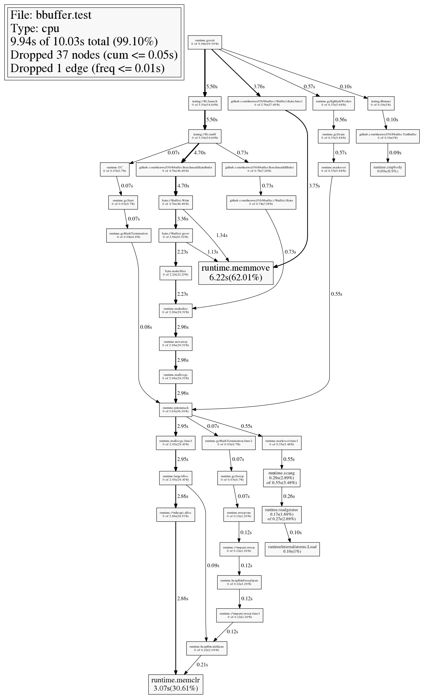
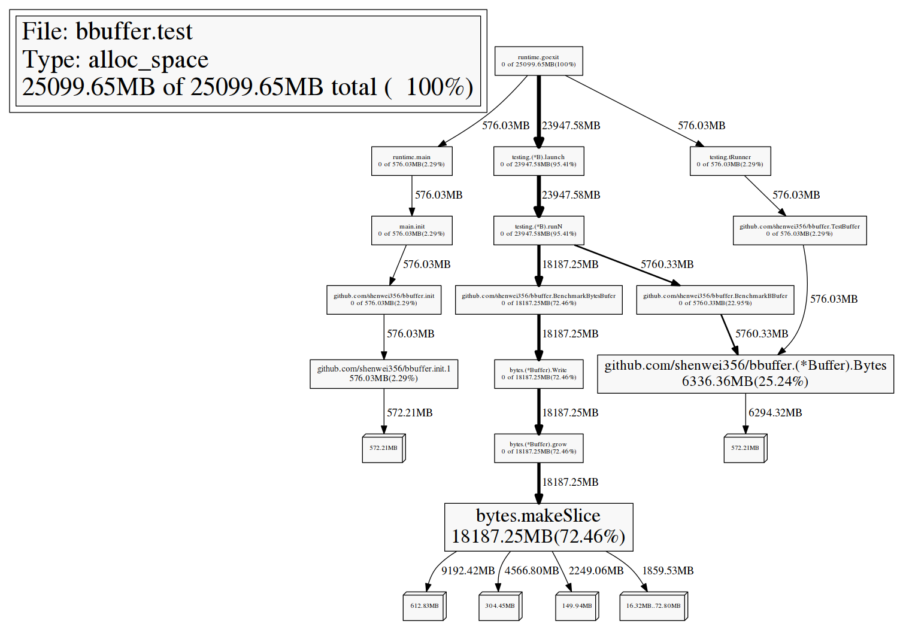

bbuffer
===

`bbufer` -- a more efficient bytes buffer both in time and memory
compared to the standard library `bytes.Buffer`.

`bytes.Buffer` frequently allots space and copies `slice` when the buffer size grows.
However `bbufer` just stores the data from method `Writes()` into `slice` of `byte
slice` (`[][]byte`), and only copies once when we need all the data by calling
 method `Bytes()`, which could reduce memory allocation.

Install
-------

This package is "go-gettable", just:

    go get -u github.com/shenwei356/bbuffer

Usage
------

Just like `bytes.Buffer`

    import "github.com/shenwei356/bbuffer"
    var b bbufer.Buffer // or b := bbufer.NewBuffer()
    b.Write(data)       // write []byte to it
    b.Bytes()           // return the data
    b.Reset()           // reset

Benchmark
------

Time

    $ go test -bench=. -memprofile mem.out -cpuprofile cpu.out
    generate test data for test. scale 1/3: 1000
    generate test data for test. scale 2/3: 1000000
    generate test data for test. scale 3/3: 100000000
    PASS
    BenchmarkBBufer-4       2000000000               0.08 ns/op
    BenchmarkBytesBufer-4   2000000000               0.16 ns/op

CPU profile

    $ go tool pprof ./bbuffer.test cpu.out

Allocated memory

    $ go tool pprof --alloc_space ./bbuffer.test mem.out

License
-------

Copyright (c) 2016, Wei Shen (shenwei356@gmail.com)

[MIT License](https://github.com/shenwei356/bbuffer/blob/master/LICENSE)
